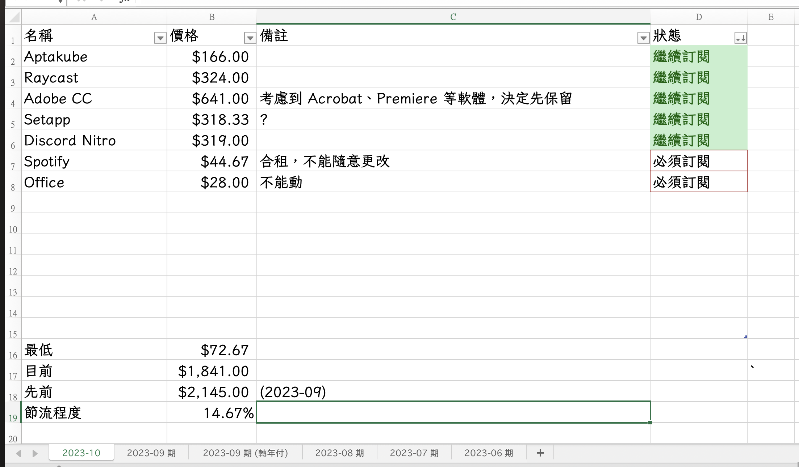

# 訂閱項目小助手

我很常訂閱比如 Adobe、Office 等等的軟體，但苦於缺少一個統一的地方查看我訂閱的所有東西，總是得等到信用卡扣款的時候才知道「原來我有訂閱這個東西。」

現有的記帳軟體（如簡單記帳、麻布記帳等）雖然在記隨手帳方面很好用，不過很少有軟體可以設定「定時扣款」的項目。之前我為了要解決這個問題，寫了一個 Excel 表格，用來記錄我當月的訂閱項目，並且可以判斷訂閱費用是否又有增長：

但是我做的這張表格，有兩個很大的缺點：

- Excel 的手機版很不適合「隨手記帳」，假如我在 App Store 訂閱一個軟體，我還得打開 Excel、找到檔案、找到表格、插入項目、恢復公式 ⋯⋯ 久而久之，我就懶著記錄了。
- 我的 Excel 表格當時沒有特別記載「我是在什麼時候訂閱這個軟體的。」我只能知道「這個月有多少軟體要付，」但卻不知道我什麼時候該付。
- Excel 很難用訊息推播的方式，告訴我「幾天後要付 XX 軟體的錢」，依然還是要等到刷卡通知出現的時候，才知道這個軟體要付錢了。

為了解決以上兩個問題，我決定寫一個手機和電腦都能使用的 App，在滿足上面這些需求的同時，我希望我還可以用語音輸入來增加項目：講完「我用了某張信用卡刷了某個軟體」後，系統就能自動幫我分類到對應的信用卡裡面。

## 預期目標

- [x] 可以新增刷卡的卡片（比如「台新銀行」、「玉山銀行」等等）
- [x] 可以記錄訂閱項目和其金額、訂閱日期以及訂閱週期（每月、每年等）
- [ ] 可以設定提醒時間，提醒我「幾天後通知要訂閱什麼？」
- [ ] 可以將語音輸入的內容自動分類到對應的卡片裡面，同時還要支援容錯功能。
- [ ] 可以有一個漂亮的 App 讓我可以快速新增項目。

## 儲存庫

### Frontend

- React Native application: <https://github.com/pan-subscribe-manager/app-react-native>

### Backend

- Python implementation: <https://github.com/pan-subscribe-manager/backend-python>

